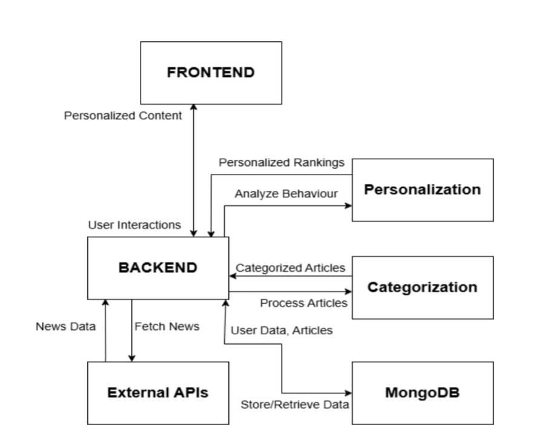

# 📰 Personalized News Aggregator With Content Recommendation

A full-stack, machine learning–powered web application that delivers **personalized, categorized, and accessible news content** by analyzing user behavior and article semantics in real time.

This project demonstrates practical experience in **full-stack development**, **recommendation systems**, and **NLP-driven content classification**.

---

## 🚀 Why This Project Matters

Modern users are overwhelmed by generic news feeds that ignore individual preferences.  
This application solves that problem by:

- Automatically categorizing news articles using NLP
- Learning from user interactions to personalize content
- Delivering a clean, responsive, and accessible reading experience
- Scaling efficiently using a modular client–server architecture

The system adapts continuously as users engage with content, similar to recommendation engines used by large consumer platforms.

---

## 🧠 High-Level Architecture

## 🏗️ Architecture



**Client–Server Architecture**

- **Frontend (React.js)**  
  Handles UI rendering, user interactions, and accessibility features like text-to-speech.

- **Backend (Node.js + Express)**  
  Manages APIs, authentication, personalization logic, and data orchestration.

- **Database (MongoDB)**  
  Stores users, articles, and interaction history.

- **Machine Learning Layer**
  - Transformer-based NLP trained model for article categorization
  - Neural network–based personalization using behavioral signals

---

## ✨ Key Features

- 🔐 Secure authentication using JWT & bcrypt
- 🗂️ Automatic article categorization (NLP-based)
- 🧠 Personalized news feed based on user behavior
- ❤️ Like, comment, and share functionality
- 🔊 Text-to-Speech for improved accessibility
- ⏱️ Reading time tracking
- 📱 Fully responsive UI

---

## 🧪 Machine Learning & Personalization

### Article Categorization
- Uses a transformer-based trained model (DistilBERT)
- Classifies articles into:
  - Politics
  - Business
  - Sports
  - Science & Technology
  - General

### Personalization Engine
- Built using **TensorFlow.js**
- Ranks articles based on:
  - Likes
  - Reading duration
  - Category preferences
- Continuously improves recommendations as interaction data grows

---

## 📊 Performance Metrics

- Categorization accuracy: **~92%**
- Precision: **93%**
- Recall: **91%**
- F1 Score: **92%**
- Average authentication latency: **~2 seconds**
- Average categorization time: **~4 seconds**

---

## 🛠️ Tech Stack

### Frontend
- React.js
- JavaScript
- HTML, CSS
- Tailwind CSS

### Backend
- Node.js
- Express.js
- JWT, bcrypt

### Database
- MongoDB

### Machine Learning
- Python
- Hugging Face Transformers (DistilBERT)
- TensorFlow.js
- Pandas, NumPy

---

## 📁 Project Structure
```
Personalized-News-Aggregator-With-Content-Recommendationnews/
│── architecture.png
|
├── backend/
│ ├── models/
│ ├── index.js
│ ├── categorizer.py
│ ├── fine_tune.py
│ ├── package.json
│ └── .env.example
│
├── src/
│ ├── components/
│ ├── pages/
│ └── App.js
│
├── public/
├── README.md
├── .gitignore
└── package.json

```

---

## ⚙️ Getting Started

### Prerequisites
- Node.js
- MongoDB
- Python 3.9+

### Backend Setup
```bash
cd backend
npm install
node index.js
Frontend Setup
npm install
npm start
🔐 Environment Variables
Create a .env file inside backend/:

PORT=5000
MONGO_URI=your_mongodb_connection_string
JWT_SECRET=your_jwt_secret
NEWS_API_KEY=your_newsapi_key
GNEWS_API_KEY=your_gnews_key

```
🔮 Future Improvements
Mobile application (Android & iOS)

Offline reading mode

Multi-language support

Trend analysis & topic forecasting

User analytics dashboard

Premium subscription features

